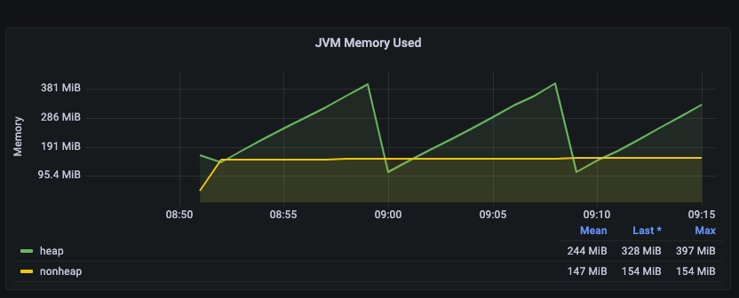

# JVM Memory Analysis

## JVM Monitoring

We want to gain more insights into the JVM memory metrics.

### Useful Resources
* [Kafka Monitoring and Metrics Using JMX with Docker documentation](https://docs.confluent.io/platform/current/installation/docker/operations/monitoring.html)
* [JMX Exporter Repository](https://github.com/prometheus/jmx_exporter)
* [jmx-monitoring-stacks Repository](https://github.com/confluentinc/jmx-monitoring-stacks/tree/7.2-post/shared-assets/jmx-exporter)

### JConsole
We want to run the JMX Exporter as the Java agent, therefore
we need to download the Jar.
From the [jmx-monitoring-stacks repository](https://github.com/confluentinc/jmx-monitoring-stacks/tree/7.2-post/shared-assets/jmx-exporter)
we copy the corresponding yaml files.

We add to the `docker-compose` file

```yaml
volumes:
    - ./Metrics/jmx-exporter/:/usr/share/jmx-exporter
...
EXTRA_ARGS:
    -javaagent:/usr/share/jmx-exporter/jmx_prometheus_javaagent-0.18.0.jar=1234:/usr/share/jmx-exporter/broker.yml
```

We can now start JConsole with the command `jconsole localhost:9991` and see memory metrics.

### Prometheus

We configure the `./Prometheus/prometheus.yml` and
add to the `docker-compose` file

```yaml
prometheus:
  image: prom/prometheus:main
  hostname: prometheus
  container_name: prometheus
  ports:
    - 9090:9090
  volumes:
    - ./Metrics/Prometheus:/etc/prometheus
```

We can now start Prometheus under `localhost:9090` and scrape the memory information
per CP component via:

```
jvm_memory_bytes_used
```

### Grafana

We configure the `./grafana` and
add to the `docker-compose` file

```yaml
grafana:
  image: grafana/grafana:8.1.3
  container_name: grafana
  environment:
    - "GF_SECURITY_ADMIN_USER=admin"
    - "GF_SECURITY_ADMIN_PASSWORD=password"
    - "GF_USERS_ALLOW_SIGN_UP=false"
  ports:
    - 3000:3000
  volumes:
    - ./grafana/provisioning/:/etc/grafana/provisioning
```

We can now start Grafana under `localhost:3000` with admin/password and
see all Connect metrics in the corresponding dashboard.



To see what are the JVM configuration, we execute `docker top connect`
displaying an initial memory request of 256 MB and a maximum of 2 GB.
```shell
java -Xms256M -Xmx2G
```


## Memory Heap Dump Analysis

We need to get the java process id (pid) --> 127

```shell
docker exec -it connect bash
jps

13936 Jps
127 ConnectDistributed
```

We create the heap dump
```shell
docker exec connect jmap -dump:live,format=b,file=/tmp/connectdump.hprof 127

Dumping heap to /tmp/connectdump.hprof ...
Heap dump file created [54974008 bytes in 0.338 secs]
```

We extract the heap dump out of the connect container
```
sudo docker cp connect:/tmp/connectdump.hprof .
```

### Analyze Heap Dump

```shell
sudo jhat -port 7401 -J-Xmx4G connectdump.hprof
```

Under `localhost:7401` we can start analyzing it.
For more information, see this [guideline](https://blog.gceasy.io/2015/08/28/jhat-heap-dump-analysis/).

