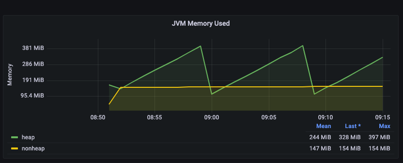

# IBM MQ Troubleshooting

This repository tackles several questions regarding Kafka Connect and
the IBM MQ Connector.

* [IBM MQ Source Connector](https://docs.confluent.io/kafka-connectors/ibmmq-source/current/overview.html)
* [IBM MQ Sink Connector](https://docs.confluent.io/kafka-connectors/ibmmq-sink/current/overview.html)

You can start the environment with:

```shell
docker-compose up -d
```


## JVM Metrics via JMX Exporter

We want to gain more insights into the JVM memory metrics.

### Useful Resources
* [Kafka Monitoring and Metrics Using JMX with Docker documentation](https://docs.confluent.io/platform/current/installation/docker/operations/monitoring.html)
* [JMX Exporter Repository](https://github.com/prometheus/jmx_exporter)
* [jmx-monitoring-stacks Repository](https://github.com/confluentinc/jmx-monitoring-stacks/tree/7.2-post/shared-assets/jmx-exporter)

### JConsole
We want to run the JMX Exporter as the Java agent, therefore
we need to download the Jar.
From the [jmx-monitoring-stacks repository](https://github.com/confluentinc/jmx-monitoring-stacks/tree/7.2-post/shared-assets/jmx-exporter)
we copy the corresponding yaml files.

We add to the `docker-compose` file

```yaml
volumes:
    - ./Metrics/jmx-exporter/:/usr/share/jmx-exporter
...
EXTRA_ARGS:
    -javaagent:/usr/share/jmx-exporter/jmx_prometheus_javaagent-0.18.0.jar=1234:/usr/share/jmx-exporter/broker.yml
```

We can now start JConsole with the command `jconsole localhost:9991` and see memory metrics.

### Prometheus

We configure the `./Prometheus/prometheus.yml` and 
add to the `docker-compose` file

```yaml
prometheus:
  image: prom/prometheus:main
  hostname: prometheus
  container_name: prometheus
  ports:
    - 9090:9090
  volumes:
    - ./Metrics/Prometheus:/etc/prometheus
```

We can now start Prometheus under `localhost:9090` and scrape the memory information
per CP component via:

```
jvm_memory_bytes_used
```

### Grafana

We configure the `./grafana` and
add to the `docker-compose` file

```yaml
grafana:
  image: grafana/grafana:8.1.3
  container_name: grafana
  environment:
    - "GF_SECURITY_ADMIN_USER=admin"
    - "GF_SECURITY_ADMIN_PASSWORD=password"
    - "GF_USERS_ALLOW_SIGN_UP=false"
  ports:
    - 3000:3000
  volumes:
    - ./grafana/provisioning/:/etc/grafana/provisioning
```

We can now start Grafana under `localhost:3000` with admin/password and 
see all Connect metrics in the corresponding dashboard.




## IBM MQ Source extract payload

We want to extract the payload from the message.

### Useful Resources

* [ExtractField SMT](https://docs.confluent.io/platform/current/connect/transforms/extractfield.html#extractfield)
* [JMS Value Schema](https://docs.confluent.io/kafka-connectors/ibmmq-source/current/overview.html#io-confluent-connect-jms-value)
* [demo-scene Repository](https://github.com/confluentinc/demo-scene/tree/master/ibm-demo)

### IBM MQ UI

Login under [https://localhost:9443/ibmmq/console/login.html](https://localhost:9443/ibmmq/console/login.html) with admin/passw0rd.
We produce events into the `DEV.QUEUE.1`.

### Run the IBM MQ Source Connector

We add the SMT to the connector config
```yaml
"transforms": "ExtractField",
"transforms.ExtractField.type":"org.apache.kafka.connect.transforms.ExtractField$Value",
"transforms.ExtractField.field":"text"
```

We start the connector
```shell
docker exec -it connect curl -d "@/ibmmq/ibmmq-source.json" -X PUT -H "Content-Type: application/json" http://connect:8083/connectors/ibmmq-source/config
```

### Consume messages

The message payload get extracted, we verify it

```shell
kafka-console-consumer --bootstrap-server localhost:9092 --topic ibmmq --from-beginning

_>message1
_>message2
```

## Check Connector and Task Status

All REST endpoints can be found in the [documentation](https://docs.confluent.io/platform/current/connect/references/restapi.html#kconnect-cluster)

```shell
curl -s -XGET http://localhost:8083/connectors\?expand\=status | jq
```
Retrieves additional state information for each of the connectors returned in the API call. The endpoint also returns the status of each of the connectors and its tasks as shown in the ?expand=status example below.

```json
{
  "ibmmq-source": {
    "status": {
      "name": "ibmmq-source",
      "connector": {
        "state": "RUNNING",
        "worker_id": "connect:8083"
      },
      "tasks": [
        {
          "id": 0,
          "state": "RUNNING",
          "worker_id": "connect:8083"
        },
        {
          "id": 1,
          "state": "RUNNING",
          "worker_id": "connect:8083"
        }
      ],
      "type": "source"
    }
  }
}
```